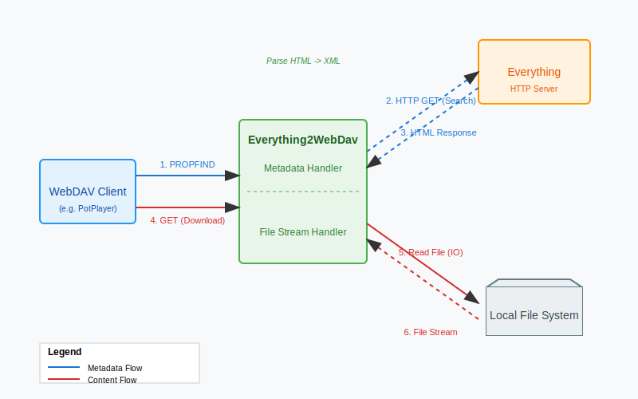

# Everything2WebDav

Everything2WebDav 是一个 Java Spring Boot 应用程序，旨在充当桥梁，将 [Everything](https://www.voidtools.com/) 强大的文件搜索服务的 HTTP 接口转换为标准的 WebDAV 协议。

通过本项目，你可以使用任何支持 WebDAV 的客户端（如 CX文件管理器、FE文件管理器、流舟文件 等）直接浏览、搜索、播放和下载 Everything 索引的文件。部分客户端的协议实现可能有差异，如果存在bad case可以提issues。



## ✨ 主要功能

*   **WebDAV 协议支持**: 实现了 WebDAV 的核心方法，包括 `PROPFIND`, `GET`, `HEAD`, `OPTIONS` 等。
*   **目录浏览**: 实时解析 Everything 的 HTTP 页面，将其转换为 WebDAV 目录结构。
*   **文件操作**:
    *   **下载**: 支持流式传输，直接读取本地文件系统。
    *   **断点续传/视频流**: 完美支持 HTTP `Range` 请求，允许视频播放器进行拖动进度条、断点续播。
    *   **文件管理**: 初步支持 `DELETE`, `PUT`, `MKCOL`, `MOVE`, `COPY` (基于本地文件系统操作)。
*   **路径映射**: 支持灵活的路径映射配置 (`base.path.map`)，解决 Everything 索引路径与 WebDAV 访问路径不一致的问题。

## 🛠️ 环境要求

*   **JDK**: Java 8 或更高版本
*   **Maven**: 用于构建项目
*   **Everything**: 已安装并开启 HTTP 服务器功能的 Everything

## ⚙️ 配置说明

配置文件位于 `src/main/resources/application.properties`。

```properties
# WebDAV 服务监听端口
server.port=8080

# Everything HTTP 服务的地址 (请确保末尾没有斜杠，或者根据实际情况调整)
everything.url=http://127.0.0.1:80

# 路径映射配置
# 格式为 JSON 风格的 Map: {"WebDAV路径前缀" : "本地真实路径前缀"}
# 例如，如果 Everything 返回的文件路径是 "D:\Movies\...", 而你想在 WebDAV 中映射为 "Z:\Movies\..."
# 或者单纯用于路径修正
base.path.map={ "D:/" : "Z:/" }
```

### 关键配置详解

*   **`everything.url`**: 这是你的 Everything 软件中 "工具" -> "选项" -> "HTTP 服务器" 中设置的地址。
*   **`base.path.map`**: 这是一个非常重要的配置。有时 Everything 返回的路径（本地绝对路径）可能需要映射才能被正确访问，或者你希望隐藏真实的盘符。
    *   注意：配置格式虽然类似 JSON，但解析逻辑是自定义的，支持简单的键值对。

## 🚀 运行指南

### 1. 编译项目

在项目根目录下运行 Maven 命令进行打包：

```bash
mvn clean package
```

### 2. 启动服务

#### 手动方式

```bash
java -Dfile.encoding=UTF-8 -jar target/everything2webDav-1.0-SNAPSHOT.jar
```

### 3. 客户端连接

*   **WebDAV URL**: `http://localhost:8080/` (或你配置的端口)
*   **用户名/密码**: 取决于 Everything HTTP 服务是否设置了账号密码。本项目会透传 `Authorization` 头信息。

## 📄 许可证

MIT License
